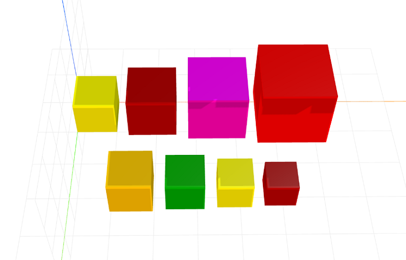

# grow-layout
Parameterized grow/shrink function for CraftML

### Install
    $ npm install grow-layout

### Parameters
- factor: adjusts percentage of growth / shrinkage

### Example
```html
<craft>
    <craft name="grow-layout" module="grow-layout"/>
    
    <col spacing="10">
        <row spacing="3">
            <grow-layout>
                <repeat n="4">
                    <cube></cube>
                </repeat>
            </grow-layout> 
        </row>
        
        <row spacing="3">
            <grow-layout factor="0.9">
                <repeat n="4">
                    <cube></cube>
                </repeat>
            </grow-layout> 
        </row>
    </col>

</craft>
```

